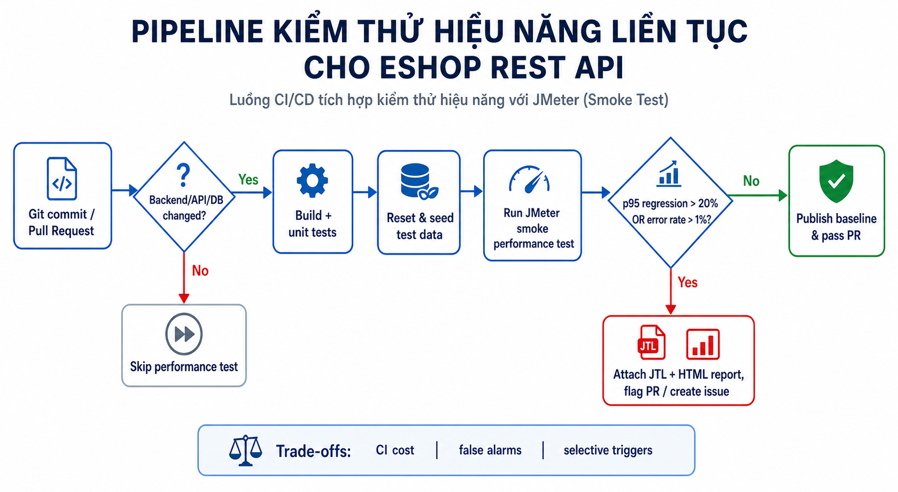

# HW05-AI - Performance Testing Report

> Ngày thực thi: 31/08/2026 (UTC+7) · SUT cục bộ: `http://localhost:3000` · Công cụ: Apache JMeter 5.6.3. Kết luận chỉ áp dụng cho điều kiện và artefact được liên kết bên dưới.

## 1. Mục tiêu, SUT và môi trường

Mục tiêu là kiểm thử workflow REST E2E của EShop qua Load, Stress, Spike và endurance khoảng 10 phút; sau đó phân tích raw JTL và đề xuất continuous performance testing. Backend EShop dùng SQLite cục bộ. Trước mỗi run ngắn, dữ liệu được reset/seed bằng [`reset-seed-hw5.mjs`](../../scripts/reset-seed-hw5.mjs).

| Thành phần | Giá trị đã xác minh |
| --- | --- |
| Máy chạy | ASUS TUF Gaming A15 FA506NFR_FA506NFR |
| CPU | AMD Ryzen 7 7435HS, 8 cores / 16 logical processors, 3.10 GHz nominal |
| RAM | 15.82 GiB |
| Hệ điều hành | Windows 11 Home Single Language 64-bit, 10.0.26200 |
| SUT / generator | EShop backend local; JMeter 5.6.3; Node.js backend |

Ảnh DXDIAG xác nhận cấu hình và thời điểm máy chạy có tại [dxdiag-hardware-20260831.png](../../evidence/hardware/dxdiag-hardware-20260831.png).

## 2. Workflow và endpoint mapping

Workflow tái sử dụng phạm vi HW2: `POST /api/login` -> `GET /api/orders/my-orders` -> `PUT /api/orders/:id/cancel`. Lựa chọn không trùng workflow Vân đã công bố: `POST /register`, `/api/products/:id` và `POST /api/checkout`.

| Bước | Nhóm endpoint | API | Dữ liệu vào/ra | Liên hệ FR |
| --- | --- | --- | --- | --- |
| 1 | Auth-heavy | `POST /api/login` | CSV `email,password` -> JWT | FR-02 |
| 2 | Read-heavy | `GET /api/orders/my-orders` | JWT -> danh sách đơn -> `orderId` | FR-11 |
| 3 | Transactional | `PUT /api/orders/:id/cancel` | JWT + `orderId` -> `canceled` | FR-10, FR-11 |

Mỗi virtual user dùng account riêng. Script seed tạo đơn `pending`/`confirmed` để extractor lấy `orderId`, không hard-code ID; sau run, đơn bị hủy không tái sử dụng. CSV local không có tài khoản thật và bị git-ignore.

## 3. Thiết kế bằng AI và human review

AI được dùng theo từng bước để chọn workflow, dựng JMX, seed data và phân tích JTL; lịch sử có trong [AI Audit](AI%20Audit/01_AI-Audit-Report.md). Bốn plan sinh từ [`generate-jmeter-plans.mjs`](../../scripts/generate-jmeter-plans.mjs), sau đó được kiểm tra XML và sửa lỗi listener trước khi chạy. Ba plan bắt buộc dùng ba listener khác nhau: View Results Tree, Summary Report và Aggregate Report.

| Kịch bản | Plan | Threads / ramp-up / loops | Think-time | Mục đích / review |
| --- | --- | --- | --- | --- |
| Load | [`Load`](../../performance/test-plans/23127173_Load_20260831.jmx) | 10 / 20 s / 1 | 1.5 s | Tải nhẹ, tránh burst lúc bắt đầu. |
| Stress | [`Stress`](../../performance/test-plans/23127173_Stress_20260831.jmx) | 30 / 30 s / 1 | 1.0 s | Tải cao hơn, không được gọi là điểm gãy. |
| Spike | [`Spike`](../../performance/test-plans/23127173_Spike_20260831.jmx) | 50 / 1 s / 1 | 0.5 s | Burst có chủ đích, khác endurance. |
| Endurance | [`Endurance`](../../performance/test-plans/23127173_Endurance_20260831.jmx) | 10 / 30 s / 120 | 1.6 s | Soak 601.15 s; 1,500 account/đơn độc lập. |

Sampler có assertion HTTP 200 và JSON extractor JWT/orderId. Credentials đều hợp lệ nên lockout không phát sinh; reset/seed trước run khôi phục đơn có thể hủy. Hai listener do AI sinh đầu tiên không tương thích JMeter 5.6.3 (`grpThreads`/`groupThreads`); đã bỏ save-service tùy biến và xác nhận JMX sau sửa. Vì vậy JMX AI sinh lần đầu không được xem là artefact đủ dùng.

## 4. Evidence và quy ước số liệu

Raw logs và HTML reports là nguồn chính. “Workflow” chỉ đếm parent transaction `E2E login - orders - cancel`; mỗi workflow có ba HTTP sampler nên JTL có bốn sample/workflow. p95 là nearest-rank tính từ parent rows raw JTL, có thể khác nhẹ percentile nội suy của HTML report.

| Kịch bản | Raw JTL | HTML report | Parent workflow / toàn bộ sample |
| --- | --- | --- | ---: |
| Load | [`Load.jtl`](../../performance/raw-jtl/23127173_Load_20260831.jtl) | [HTML](../../performance/html-reports/23127173_Load_20260831/index.html) | 10 / 40 |
| Stress | [`Stress.jtl`](../../performance/raw-jtl/23127173_Stress_20260831.jtl) | [HTML](../../performance/html-reports/23127173_Stress_20260831/index.html) | 30 / 120 |
| Spike | [`Spike.jtl`](../../performance/raw-jtl/23127173_Spike_20260831.jtl) | [HTML](../../performance/html-reports/23127173_Spike_20260831/index.html) | 50 / 200 |
| Endurance | [`Endurance.jtl`](../../performance/raw-jtl/23127173_Endurance_20260831.jtl) | [HTML](../../performance/html-reports/23127173_Endurance_20260831/index.html) | 1,200 / 4,800 |

Ảnh JMeter + Task Manager của từng scenario được lưu riêng: [Load](../../evidence/resource-monitor/load-jmeter-task-manager-20260831.png), [Stress](../../evidence/resource-monitor/stress-jmeter-task-manager-20260831.png), [Spike](../../evidence/resource-monitor/spike-jmeter-task-manager-20260831.png) và [Endurance](../../evidence/resource-monitor/endurance-jmeter-task-manager-20260831.png). Ba JTL rerun tương ứng được giữ tại `performance/raw-jtl/*_evidence-rerun.jtl` để đối chiếu ảnh; chúng là evidence bổ sung, không thay thế raw log gốc trong bảng.

## 5. Kết quả Load, Stress và Spike

| Kịch bản | Workflow | Lỗi parent | Mean workflow | p95 workflow | Max workflow | JMeter transaction throughput |
| --- | ---: | ---: | ---: | ---: | ---: | ---: |
| Load | 10 | 0 (0%) | 4,536.80 ms | 4,659 ms | 4,659 ms | 0.445 workflow/s |
| Stress | 30 | 0 (0%) | 3,021.87 ms | 3,022 ms | 3,123 ms | 0.938 workflow/s |
| Spike | 50 | 0 (0%) | 1,548.66 ms | 1,682 ms | 1,714 ms | 20.400 workflow/s |

Không có HTTP error trong ba run. Workflow latency **không phải** backend latency thuần: Constant Timer được scope cho sampler trong transaction, nên parent chứa khoảng ba lần think-time. Ví dụ Load: endpoint mean là login 5.8 ms, my-orders 3.0 ms, cancel 12.3 ms, nhưng parent mean 4,536.8 ms. Không được dùng p95 parent để kết luận backend chậm 1.5–4.8 giây. Spike throughput cao hơn do ramp 1 s, burst ngắn và think-time nhỏ; không chứng minh sustainable capacity.

## 6. Endurance và ngưỡng quan sát

Endurance hoàn tất trong **601.15 s**: 10 threads × 120 loops = 1,200 parent workflow, 4,800 sample, 0 lỗi. Parent mean **4,824.38 ms**, p95 **4,840 ms**, max **4,939 ms**; JMeter báo **1.980 workflow/s**. Endpoint mean vẫn thấp: login 2.42 ms, my-orders 2.48 ms, cancel 16.69 ms; chênh lệch là think-time.

Trong đúng cấu hình này, mức bền quan sát được là **1.980 parent workflow/s không lỗi trong 601.15 s**. Đây không phải maximum stable RPS vì chưa có dải tải tăng dần để tìm điểm gãy. Một endurance rerun cùng cấu hình lấy **61 mẫu/10 giây trong 620 giây**: backend Node.js working set min **76.75 MB**, trung bình **78.32 MB**, peak **79.14 MB**; RAM hệ thống sử dụng min **78.94%**, trung bình **82.01%**, peak **83.29%**. CSV và cách tính ở [endurance-memory-samples-20260831.csv](../../evidence/endurance/endurance-memory-samples-20260831.csv) và [memory-observation.md](../../evidence/endurance/memory-observation.md). Vì vậy 79.14 MB là **trần backend quan sát được trong workload này**, không phải giới hạn vật lý hay memory ceiling tổng quát của máy.

## 7. AI analysis và misinterpretation hunt

| Diễn giải cần bác bỏ | Giá trị đúng | Human review |
| --- | --- | --- |
| “4,800 sample endurance = 4,800 workflow.” | 1,200 parent transaction + 3,600 HTTP child sample. | Đếm parent label khi báo workflow/RPS. |
| “p95 4,840 ms là backend latency.” | Endpoint mean endurance: 2.42 / 2.48 / 16.69 ms. | Parent timing gồm think-time. |
| “Spike 20.400 workflow/s là sustainable capacity.” | Spike: 50 users, ramp 1 s, think 0.5 s; endurance: 10 users, think 1.6 s. | Không ngoại suy capacity từ workload khác điều kiện. |

Index là **khả thi để thử nghiệm** nhưng chưa có query plan nên không triển khai; SQLite WAL là **khả thi để benchmark A/B** nhưng không được gán là nguyên nhân khi chưa có contention; connection pool **không có căn cứ trong SUT SQLite hiện tại**. Raw log, scope timer và workload phải được kiểm tra trước khi nhận tối ưu hóa AI.

## 8. Continuous Performance Testing proposal

Gói [Continuous Performance Testing](../../continuous-performance-testing/README.md) đề xuất GitHub Actions theo dõi thay đổi backend/database, khởi động SUT, health check, reset/seed, chạy JMeter smoke non-GUI, so sánh JTL với baseline và upload JTL/HTML. Gate fail khi error rate >1% hoặc p95 tăng >20%. Path filter tiết kiệm CI cost nhưng có thể bỏ sót thay đổi gián tiếp; threshold quá chặt gây false alarm. Đây chưa phải CI đang bật: cần rebaseline trên runner tương đương và đưa YAML vào `.github/workflows/` của EShop.

## 9. Kết luận và trạng thái nộp bài

Đã có bốn JMX, CSV local, reset/seed, bốn raw JTL, bốn HTML report, một ảnh Endurance + Task Manager, ba Agent Skill và pipeline proposal. Không thấy HTTP error hay functional regression trong workflow đã chạy, nên không bịa GitHub Issue. Latency parent cao được giải thích bởi think-time, không được báo sai thành bug.

**Còn thiếu trước khi nộp:** video tiếng Việt unlisted >=6 phút; video demo Agent Skill; cập nhật README/checklist còn placeholder; xuất PDF, kiểm tra link và đóng ZIP. AI Critique 297 từ đã có tại [02_AI-Critique.md](AI%20Audit/02_AI-Critique.md). AI usage nằm trong [AI Audit](AI%20Audit/01_AI-Audit-Report.md); báo cáo không thay thế raw artefact.
